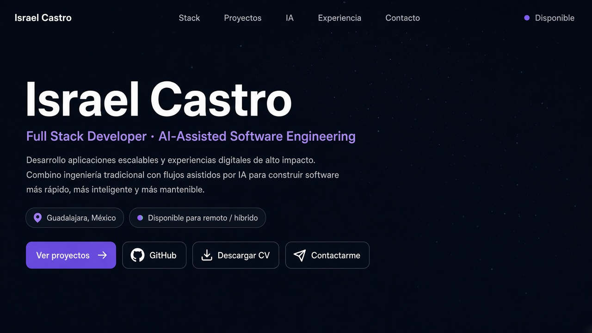

# Israel Castro — Portfolio

Portafolio de **Israel Castro**, Full Stack Developer y AI-Assisted Software Engineer. Está pensado para reclutadores: identidad clara, stack priorizado, proyectos con ownership y un workflow de IA con validación humana.



> **Screenshot placeholder.** Reemplaza `docs/screenshot.png` con una captura real del sitio en desktop (y, si puedes, una móvil) después del deploy. La imagen actual no debe usarse como evidencia de UI final.

**Contacto**

- WhatsApp: [wa.me/523331974977](https://wa.me/523331974977?text=Hola%20Israel%2C%20vi%20tu%20portafolio%20y%20me%20gustaría%20contactarte.)
- Correo: [israelcastro997@gmail.com](mailto:israelcastro997@gmail.com)
- GitHub: [github.com/IsraelCastro997](https://github.com/IsraelCastro997)
- LinkedIn: [linkedin.com/in/israel-castro-a5637b216](https://www.linkedin.com/in/israel-castro-a5637b216)

## Descripción

Landing única (React + Vite) para postular a roles Full Stack, Backend, Frontend, Mobile, AI-Assisted Engineering y liderazgo técnico. El contacto es directo (WhatsApp, email, LinkedIn, GitHub): no hay formulario ni servicios de envío de correo.

## Stack del sitio

- React 18 + Vite
- Tailwind CSS
- Framer Motion (animaciones ligeras, respetan `prefers-reduced-motion`)
- Vitest

## Instalación

```bash
npm install
```

## Variables de entorno

Opcional. Copia `.env.example` a `.env` solo si vas a definir la URL pública:

```bash
cp .env.example .env
```

| Variable | Uso |
| --- | --- |
| `VITE_SITE_URL` | URL canónica / Open Graph (dominio de producción) |

No se requieren API keys. El sitio funciona sin `.env`.

## Desarrollo local

```bash
npm run dev
```

## Testing

```bash
npm test
npm run lint
```

## Build

```bash
npm run build
npm run preview
```

## Deployment

Publica `dist/` en Vercel, Netlify, GitHub Pages u otro static host. Si conoces el dominio final, define `VITE_SITE_URL` en el proveedor para canonical y OG absolutos.

## CV

El botón **Download CV** apunta a `/Israel-Castro-CV.pdf`.

1. Coloca tu PDF oficial en `public/Israel-Castro-CV.pdf`.
2. No inventes ni commitees un PDF vacío.
3. `src/config/site.js` ya usa `cvPath: "/Israel-Castro-CV.pdf"`.

Hasta que el archivo exista, ese CTA devolverá 404 en local y en producción.

## Estructura

```
src/
  components/   Hero, stack, proyectos, IA, experiencia, enfoque, contacto
  constants/    Contenido
  config/       Contacto público y ruta del CV
  utils/        Animaciones
public/
  Israel-Castro-CV.pdf
  projects/              ← screenshots reales (ver abajo)
  logo.svg
  og.png
  robots.txt
```

## Screenshots de proyectos

Las cards esperan un PNG 16:9. Hoy hay placeholder neutro. Sustituye estos archivos (no inventes capturas con datos sensibles):

| Proyecto | Archivo |
| --- | --- |
| Expertos en Convenciones | `public/projects/expertos.png` |
| TM Escolar | `public/projects/tm-escolar.png` |
| Trading Integrations | `public/projects/trading.png` |
| Marketplace & Booking | `public/projects/marketplace.png` |

Luego asigna `screenshot: "/projects/<archivo>.png"` en `src/constants/index.js`.

## Proyectos públicos vs privados

Todos los destacados son **privados** (sin Live Demo / GitHub / Case Study):

- Expertos en Convenciones
- TM Escolar
- Trading Integrations
- Marketplace & Booking Platform

Detalle técnico disponible en entrevista. No se publican datos de alumnos, URLs internas ni nombres comerciales confidenciales.

## Seguridad / secrets

- Sin EmailJS ni keys de terceros en el cliente
- `.env` está en `.gitignore` (solo `VITE_SITE_URL` es opcional)
- Sin tokens, connection strings ni repositorios privados en el código

## AI-assisted development approach

Este portafolio y el trabajo que describe usan agentes de IA para inspeccionar codebases, planear, implementar, generar tests y documentar. La IA ejecuta, propone y acelera; el criterio humano valida diffs, tests, builds, datos y comportamiento antes de aceptar un cambio.

## Contacto

Israel Castro · Guadalajara, México · remoto / híbrido.
